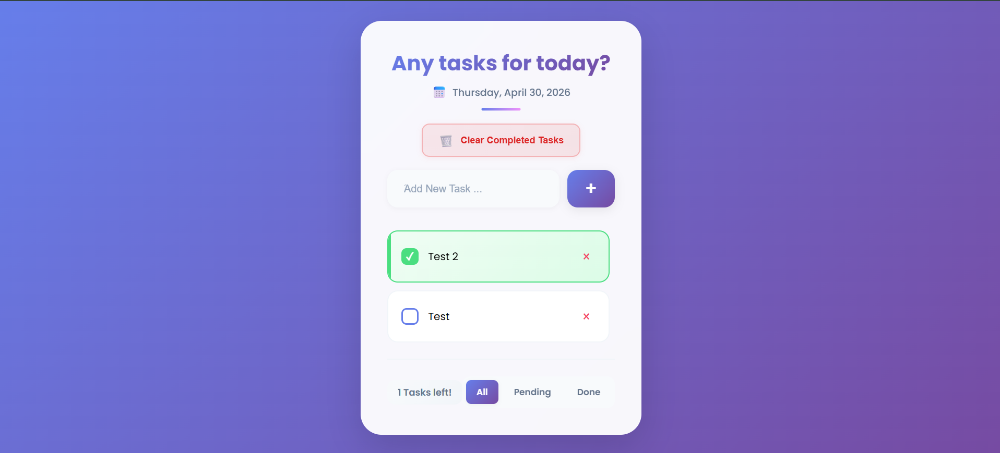
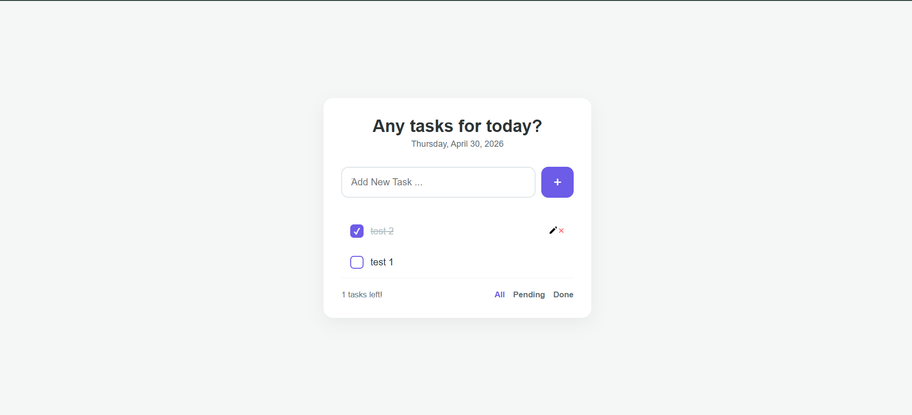

# 📝 Todo App - سه نسخه پیاده‌سازی

یک اپلیکیشن Todo List مدرن و زیبا با سه نسخه مختلف پیاده‌سازی


## ✨ ویژگی‌ها

- ✅ افزودن، ویرایش و حذف تسک
- ✅ علامت‌گذاری تسک‌ها به عنوان انجام شده
- ✅ فیلتر کردن تسک‌ها (همه، فعال، انجام شده)
- ✅ پاک کردن تسک‌های انجام شده
- ✅ ذخیره‌سازی خودکار در Local Storage
- ✅ طراحی مدرن با Glassmorphism
- ✅ انیمیشن‌های روان و حرفه‌ای
- ✅ کاملاً Responsive
- ✅ پشتیبانی از زبان فارسی

## 📸 اسکرین‌شات‌ها

### نسخه React


### نسخه Vanilla JavaScript


## 🚀 نسخه‌های موجود

### 1️⃣ Vanilla JavaScript
پیاده‌سازی ساده با JavaScript خالص
```bash
cd vanilla-js
```
# فقط index.html رو با مرورگر باز کن

**تکنولوژی‌ها:**
- HTML5
- CSS3 (Glassmorphism, Animations)
- Vanilla JavaScript (ES6+)

---

### 2️⃣ Vanilla JavaScript - OOP
پیاده‌سازی شی‌گرا با معماری تمیز

```bash
cd vanilla-js-oop
```
# فقط index.html رو با مرورگر باز کن

**تکنولوژی‌ها:**
- HTML5
- CSS3
- JavaScript ES6+ (Classes, Modules)
- Object-Oriented Programming

**معماری:**
- `TodoApp` Class: مدیریت کل اپلیکیشن
- `TodoItem` Class: مدل هر تسک
- `StorageManager` Class: مدیریت Local Storage
- Separation of Concerns

---

### 3️⃣ React + Vite
نسخه مدرن با React و Vite

```bash
cd react-app
npm install
npm run dev
```
**تکنولوژی‌ها:**
- React 18+
- Vite (Fast Build Tool)
- React Hooks (useState, useEffect, useRef)
- Component-Based Architecture
- ES6+ Modules

**کامپوننت‌ها:**
- `App.jsx`: کامپوننت اصلی
- `TodoItem.jsx`: کامپوننت هر تسک
- `FilterButtons.jsx`: دکمه‌های فیلتر
- Custom Hooks برای مدیریت state

**اسکریپت‌های موجود:**
```bash
npm run dev      # اجرای development server
npm run build    # ساخت نسخه production
npm run preview  # پیش‌نمایش build
```
## 🎨 طراحی UI/UX

- **Glassmorphism Effect**: شیشه‌ای و مدرن
- **Gradient Backgrounds**: گرادیانت‌های زیبا
- **Smooth Animations**: انیمیشن‌های روان
- **Hover Effects**: افکت‌های تعاملی
- **Custom Scrollbar**: اسکرول‌بار سفارشی
- **Responsive Design**: سازگار با موبایل و تبلت

## 📦 نصب و راه‌اندازی

### نسخه‌های Vanilla JS

# Clone کردن پروژه
```bash
git clone https://github.com/AliNematt/todo-app.git
cd todo-app
```
# باز کردن نسخه Vanilla JS
```cd vanilla-js```
# index.html رو با مرورگر باز کن

# یا نسخه OOP
```cd vanilla-js-oop```
# index.html رو با مرورگر باز کن

### نسخه React

```bash
# رفتن به فولدر React
cd react-app

# نصب dependencies
npm install

# اجرای development server
npm run dev
# باز کردن http://localhost:5173
```

## 🛠️ تکنولوژی‌های استفاده شده

| نسخه | تکنولوژی‌ها |
|------|-------------|
| Vanilla JS | HTML5, CSS3, JavaScript ES6+ |
| Vanilla JS OOP | HTML5, CSS3, JavaScript ES6+ Classes |
| React | React 18, Vite, JSX, Hooks |

## 📱 Responsive Breakpoints

- **Desktop**: > 768px
- **Tablet**: 481px - 768px
- **Mobile**: < 480px

## 🌟 ویژگی‌های پیشرفته

### Vanilla JS & OOP
- Event Delegation
- Local Storage API
- ES6+ Features (Arrow Functions, Template Literals, Destructuring)
- DOM Manipulation
- CSS Animations & Transitions

### React Version
- React Hooks (useState, useEffect, useRef)
- Component Composition
- Controlled Components
- Conditional Rendering
- Props & State Management
- Vite HMR (Hot Module Replacement)

## 🤝 مشارکت

1. Fork کنید
2. Branch جدید بسازید (`git checkout -b feature/AmazingFeature`)
3. تغییرات رو Commit کنید (`git commit -m 'Add some AmazingFeature'`)
4. Push کنید (`git push origin feature/AmazingFeature`)
5. Pull Request باز کنید

## 📝 لایسنس

این پروژه تحت لایسنس MIT منتشر شده است.

## 👨‍💻 توسعه‌دهنده

**Ali Nemat**

- GitHub: [@AliNematt](https://github.com/AliNematt)
- Email: alinemat.webdesign@gmail.com
- Website: [Website](https://alinemat.ir)

## 🙏 تشکر

- طراحی الهام گرفته از مدرن‌ترین UI/UX ترندها
- فونت فارسی: [Vazirmatn](https://github.com/rastikerdar/vazirmatn)
- در توسعه استایل و نگارش متن README از Claude Sonnet 4.6 استفاده شده است.

---

⭐ اگر این پروژه رو دوست داشتید، یک Star بدید!

